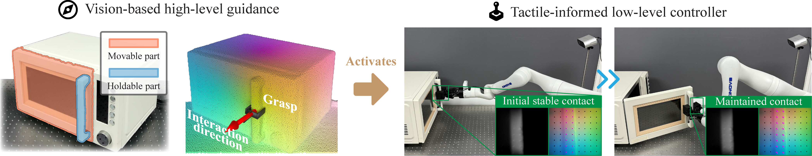

# Vi-TacMan: Articulated Object Manipulation via Vision and Touch

<div align="center">
  <a href="https://arxiv.org/abs/"></a>
  <a href='https://vi-tacman.github.io'></a>
</div>

This repository provides the official implementation of [Vi-TacMan: Articulated Object Manipulation via Vision and Touch]().



## Abstract

Autonomous manipulation of articulated objects remains a fundamental challenge for robots in human environments.
Vision-based methods can infer hidden kinematics but yield imprecise estimates on unfamiliar objects. Tactile approaches achieve robust control through contact feedback but require accurate initialization. This suggests a natural synergy: vision for global guidance, touch for local precision.
Yet no framework systematically exploits this complementarity for generalized articulated manipulation.
Here we present Vi-TacMan, which uses vision to propose grasps and coarse directions that seed a tactile controller for precise execution.
By incorporating surface normals as geometric priors and modeling directions via von Mises-Fisher distributions, our approach achieves significant gains over baselines (all $\boldsymbol{p}<0.0001$). Critically, manipulation succeeds without explicit kinematic models——the tactile controller refines coarse visual estimates through real-time contact regulation.
Tests on 50,000+ simulated and diverse real-world objects confirm robust cross-category generalization.
This work establishes that coarse visual cues suffice for reliable manipulation when coupled with tactile feedback, offering a scalable paradigm for autonomous systems in unstructured environments.

## Installation

1. Clone the repository and set up the environment

```bash
git clone https://github.com/leiyaocui/Vi-TacMan.git --recursive
git -C ./thirdparty/dinov3 apply ./thirdparty/dinov3_patch.diff

conda create -n vitacman python=3.10 -y
conda activate vitacman

pip install torch==2.5.1 torchvision==0.20.1 --index-url https://download.pytorch.org/whl/cu118
pip install pytorch3d -f https://dl.fbaipublicfiles.com/pytorch3d/packaging/wheels/py310_cu121_pyt251/download.html

pip install -r requirements.txt
pip install ./thirdparty/sam2

ln -s $(realpath ./thirdparty/sam2/sam2/configs/sam2.1) ./cfg/mask_segmentor/sam2.1
```

2. Download model weights

```bash
wget https://huggingface.co/depth-anything/Depth-Anything-V2-Large/resolve/main/depth_anything_v2_vitl.pth ./ckpt/depth_anything_v2

wget https://huggingface.co/Leiyao-Cui/Vi-TacMan/resolve/main/vitl16_detr.pth ./ckpt/dinov3_detr

wget https://dl.fbaipublicfiles.com/segment_anything_2/092824/sam2.1_hiera_large.pt ./ckpt/sam2

wget https://huggingface.co/Leiyao-Cui/Vi-TacMan/resolve/main/flow_predictor.pth ./ckpt/flow_predictor
```

You need to download the dinov3 model weights `dinov3_vitl16_pretrain_lvd1689m-8aa4cbdd.pth` from [dinov3_repo](https://github.com/facebookresearch/dinov3), and put it under `./ckpt/dinov3_detr` directory.

## Usage

We provide a ready-to-run demo that uses the images and camera parameters in `./example_data` and writes all outputs to `./log/example`.

### Quick start (with example data)

```bash
python main.py
```

What you'll get in `./log/example`:

- `color.png`: undistorted RGB image.
- `depth.png`: undistorted raw depth (uint16 mm in the original file; saved here as PNG with the same convention).
- `normal.png`: surface normals derived from the raw depth.
- `depth_predicted.png`: metric depth predicted by DepthAnythingV2 in the color camera frame (uint16 mm).
- `normal_predicted.png`: surface normals derived from the predicted depth in the color camera frame.
- `holdable_bbox.json/movable_bbox.json`: per-pair bounding boxes in [x1, y1, x2, y2] image pixels; values may be null if a corresponding pair wasn't found.
- `holdable_mask/movable_mask`: binary masks (PNG) for each detected part pair, aligned to the color image.
- `grasp_info.json`: for each pair key (e.g., "00000"), the 4x4 gripper pose (row-major), grasp width, and gripper depth; null if unavailable.
- `direction.json`: 3D unit interaction directions in the color camera frame; null if unavailable.

Note on inputs: by default, the demo expects a 16-bit depth PNG with depth in millimeters and a camera `.ini` like `CameraParam_Color1920x1080_Depth640x576.ini` (see `./example_data`). The color image, depth image, and camera parameters are exported from the Orbbec Femto Bolt device.

### Run on your own images

Override the data paths via Hydra CLI arguments:

```bash
python main.py \
  data.cam_cfg_file=/path/to/camera_param.ini \
  data.color_image_file=/path/to/color.png \
  data.depth_image_file=/path/to/depth.png
```

If your checkpoint files live elsewhere, point to them explicitly:

```bash
python main.py \
  depth_predictor.ckpt_file=/abs/path/depth_anything_v2_vitl.pth \
  object_detector.dinov3_ckpt_file=/abs/path/dinov3_vitl16_pretrain_lvd1689m-8aa4cbdd.pth \
  object_detector.detr_ckpt_file=/abs/path/vitl16_detr.pth \
  mask_segmentor.ckpt_file=/abs/path/sam2.1_hiera_large.pt \
  flow_predictor.ckpt_file=/abs/path/flow_predictor.pth
```

### Tips

- If SAM2 config isn't found, ensure the symlink step from Installation (the `ln -s ... sam2.1` line) was completed.
- If detection returns nothing, try lowering `object_detector.score_threshold`.

## Citation

If you find our research beneficial, please cite it as follows:

```bibtex

```

## Acknowledgements

This work builds on outstanding open-source contributions. We are grateful to the authors and maintainers of:

- Depth Anything v2
  - Repo: https://github.com/DepthAnything/Depth-Anything-V2
- DINOv3
  - Repo: https://github.com/facebookresearch/dinov3
- SAM 2: Segment Anything in Images and Videos
  - Repo: https://github.com/facebookresearch/sam2

All respective assets remain under their original licenses. If you use our code, please also credit and cite these projects accordingly.
